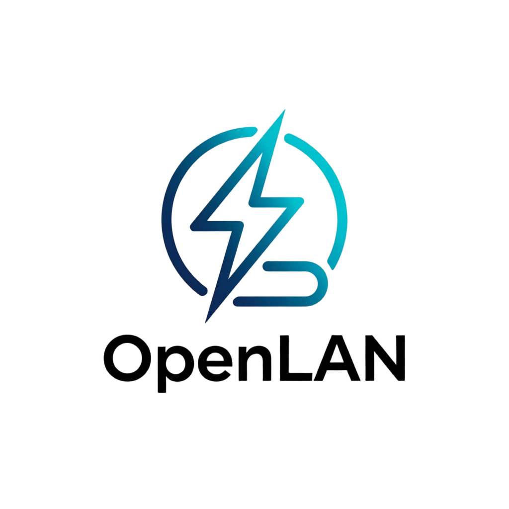

# OpenLAN

<p align="center"></p>

> 开源局域网文件急速传输工具 —— 浏览器即用 · 多线程分片下载 · 设备点对点直传 · 扫码即达

   -informational) 

OpenLAN 让局域网内的文件传输**快、稳、无门槛**：不装客户端、不注册账号、不经过任何第三方服务器。在任意设备的浏览器打开同一台机器的页面，即可浏览 / 上传 / 下载共享目录；也可以把文件或文本**点对点推送给指定设备**，或用**二维码 / 提取码**一扫即领。

## ✨ 核心能力

- **访问下载传输** —— 共享目录内的文件自动生成带签名令牌的下载链接；浏览器端**多线程并发分片（Range）**下载，速度远超单线程直传。
- **设备选择传输** —— 网页会话之间 offer 推送（对方收件箱点一下即收）；OpenLAN 实例之间**点对点直传**（`invite / go / chunk / complete` 状态机），支持 `--auto-accept` 无人值守存盘。
- **文件管理** —— 列表**搜索过滤**、**全选 / 批量**发送·下载·分享·删除、切回前台自动刷新；删除有确认弹窗、被占用时给出明确原因。
- **二维码 / 提取码** —— 手机相机扫码直达；文件可生成「二维码 + 8 位提取码 + `/s/` 短链」，随时领取。
- **文本闪电传** —— 不建文件、瞬时送达，收方一键复制或存为 `.txt`。
- **多彩主题 + 移动端适配** —— 顶部「主题」一键循环：粉色(默认) → 跟随系统 → 白色 → 黑色；手机 / 平板响应式布局与触控优化。
- 启动即自动打开浏览器、目录按相对路径展示（`.\shared`，整包移动无需改配置）、SSE 实时进度、底部传输坞、可选 PIN 门禁、双向 SHA-256 完整性校验。

## 🚀 快速开始

需要 **Node.js 18+**。默认监听 `0.0.0.0:5555`，同一局域网内任何设备都能访问。

```bash
npm install
node server/index.js
# 启动后自动用默认浏览器打开本机页面；
# 手机 / 其它电脑用终端打印的「局域网访问」地址，或扫页面顶部二维码即可访问
```

Windows 可双击 `bin/start.bat`；macOS / Linux 可用 `bash bin/start.sh`；命令行入口 `node bin/openlan.js --help`。首次启动若弹出 Windows 防火墙提示，请选择「允许 Node.js 访问专用 / 公用网络」，否则手机无法连接。

常用选项：

```bash
node server/index.js --port 8000 --dir "D:\共享" --download-dir "D:\接收" --pin 1234 --auto-accept
```

参数与环境变量的完整说明见[使用文档 · 附录](docs/使用文档.md)。

## 📖 文档

- [使用文档](docs/使用文档.md) —— 三种传输方式操作指南、文件管理、设置、安全说明、FAQ、全部参数
- [开发文档](docs/开发文档.md) —— 架构、HTTP / SSE 协议、P2P 状态机、Range 下载实现、测试方法
- [更新记录](docs/CHANGELOG.md)

## 🧩 传输方式一图流

| 想做什么 | 怎么做 |
| --- | --- |
| 电脑 A 传文件给电脑 B | A、B 都运行 OpenLAN → A「设备」页选 B → 发起传输；B 点「接收」或 `--auto-accept` 自动落盘 |
| 手机快速收电脑上的文件 | 手机扫电脑页面「二维码」→ 浏览器打开，直接多线程下载 |
| 只发一句话 / 一段文本 | 「文本闪电传」输入后瞬时送达，对方可复制或存为 `.txt` |
| 共享一个目录给一群人 | 把文件放进 `shared/`（或 `--dir` 指定目录），分享直链 `http://ip:5555/api/down/<token>` |
| 多人“自助领取” | 生成二维码 / 提取码，有效期最长 7 天，输入提取码即领 |
| 防蹭网 | 启动加 `--pin 1234`，所有页面与设备互通都需要 PIN |

## 🔒 安全设计

- 文件下载令牌由实例密钥 HMAC 签名，防目录遍历；文件被改名 / 替换即失效。
- 上传与 P2P 分块传输全程 **SHA-256 校验**，损坏数据自动丢弃，下载端合并后再次校验。
- 可选 **PIN 门禁**：网页会话 / 实例间互通均受控（两端 PIN 需一致）。
- SSE / 心跳会话离线自动回收；所有数据仅在本机局域网内流动；传输记录仅存内存，重启清零。

## 🧪 测试

```bash
npm test                      # 三项回归一次跑完（UI 一致性 / 单实例 API / 双实例 P2P 真传）
node tools/e2e-browser.mjs <URL> <共享目录>   # 可选：用本机 Edge / Chrome headless 真实驱动页面
                              # （上传 → 分片下载 → 落盘 SHA 校验 → 删除确认；需 Node ≥ 21）
```

## 📦 发布打包

```bash
npm run release:win           # 等价于 powershell -File tools/make-release.ps1
```

产物输出到 `dist/OpenLAN-<版本>.zip`（含 `node_modules`，解压即用；另加 `-NoNodeModules` 出纯净源码包），并生成同名 `.sha256` 校验文件。发布到 GitHub Releases 时，将 zip 与 `.sha256` 作为 Release 资产上传即可。

## 📱 手机 / 其它设备怎么连？

1. 手机与电脑连接**同一个 Wi-Fi**（或手机连电脑热点）。
2. 启动 OpenLAN 后看终端输出的「局域网访问」地址（如 `http://192.168.1.20:5555`）。
3. 手机扫页面顶部「二维码」→ 如有多个地址可切换 → 在浏览器打开。
4. 扫码无反应就手动输入该地址。

手机 / 平板端自动启用响应式布局：顶栏按钮图标化、弹层近全宽、输入框 16px 防 iOS 聚焦缩放。「主题」按钮同样可用。

> 无法访问时：检查防火墙是否放行 Node.js 及 TCP `5555`；公司 / 校园网络的 AP 隔离会阻断设备互访，请改用个人热点。

## 📁 目录速览

```
server/       HTTP API、P2P 引擎、UDP 组播发现、内存状态中枢
public/       无构建 SPA（多主题 · 移动端适配）
shared/       默认共享目录        downloads/  默认接收目录
test/         冒烟与一致性测试（npm test）
tools/        发布打包脚本 make-release.ps1 · 浏览器 E2E e2e-browser.mjs
docs/         使用 / 开发文档、更新记录
```

## 🤝 贡献与许可

欢迎提交 Issue / PR。代码风格与开发约定见[开发文档](docs/开发文档.md)。

[MIT](LICENSE) © OpenLAN Contributors
